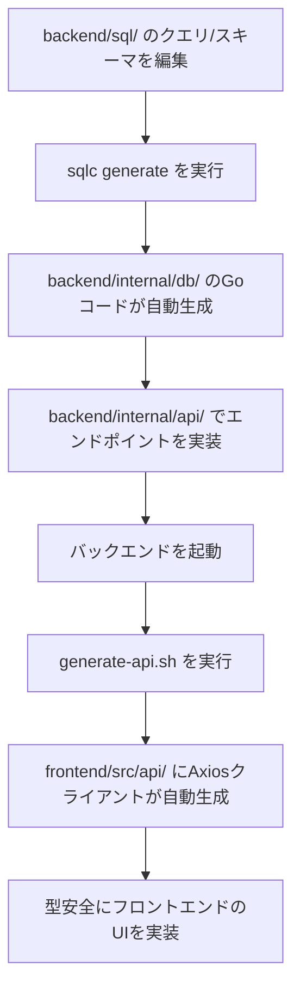

# StellerSL (ステラエスエル)

StellerSL は、ゲーミフィケーション要素（キャラクター育成、バッジ獲得、経験値システム）を取り入れた、**マルチテナント対応のTODO・タスク管理アプリケーション**です。

Go（Huma）による高速かつ型安全なバックエンドと、Vue 3（TypeScript / PrimeVue 4 / Tailwind CSS v4）によるモダンなフロントエンドで構成され、Docker Compose によりシームレスにオーケストレーションされています。

---

## 🌟 主な機能と特徴

### 1. 🎮 ゲーミフィケーション & キャラクター育成
タスクを管理する楽しさを最大化する仕組みを導入しています。
*   **経験値（EXP）＆ レベルアップ**:
    *   タスクを1つ完了するごとに **10 EXP** を獲得。
    *   100 EXP ごとにレベルアップします（`レベル = (累計EXP / 100) + 1`）。
*   **キャラクター自動進化**:
    レベルの到達度に応じて、あなたの相棒となるキャラクターが自動で進化します。
    *   🐣 **Lv. 1 - 4**: タマゴ (`egg`)
    *   🐤 **Lv. 5 - 9**: ヒヨコ (`chick`)
    *   🐔 **Lv. 10 - 19**: ニワトリ (`chicken`)
    *   🔥 **Lv. 20+**: フェニックス (`phoenix`)
*   **バッジシステム**:
    特定の条件を満たすと、自動的にバッジ（全19種）が授与されます。
    *   *例: はじめてのタスク完了（`first_task`）、3連ストリーク（`three_strike`）、早起き（`early_bird`）、深夜の夜更かし（`midnight_owl`）など*
*   **ペナルティ（ステータス変更時の減算）**:
    完了したタスクを未完了に戻した場合、**10 EXP が減算**され、レベルやキャラクター、獲得した実績バッジ（回数系）が自動で再評価・剥奪されます。これによりデータと実績の整合性を保ちます。

### 2. 🏢 強固なマルチテナント分離
*   **ホストベースのテナント解決**: HTTP `Host` ヘッダーまたは `X-Tenant-Host` ヘッダーから自動的にテナントを解決。
*   **データ隔離**: PostgreSQL の **RLS（Row Level Security / 行レベルセキュリティ）** を使用し、データベースレベルでテナントごとのデータを安全に分離・保護しています。
*   *ローカル開発環境（localhost）では、デフォルトのテナント UUID (`00000000-0000-0000-0000-000000000001`) が自動適用されます。*

### 3. 👥 チーム管理 ＆ 3階層ロール権限
*   **ロールモデル**: チームごとに `owner`（所有者）、`admin`（管理者）、`member`（メンバー）の3つのロールを定義。
*   **アクセス制御**: APIおよびUIレベルでロールに基づいた操作権限の検証（メンバー追加・削除、チーム情報の変更、チーム削除など）が行われます。

### 4. 📊 ダッシュボードとアクティビティログ
*   タスクの作成・完了・ステータス変更履歴が自動的に `activity_logs` に記録され、ダッシュボード上で視覚的に最近のアクティビティや日ごとの進捗を確認できます。

---

## 🛠️ 技術スタック

### バックエンド (Go)
*   **コア**: Go 1.22+
*   **API フレームワーク**: [Huma](https://huma.rocks/) (OpenAPI 3.1 準拠のスキーマ駆動REST APIフレームワーク) + Chi (ルーター)
*   **DBアクセス**: [sqlc](https://sqlc.dev/) (SQLから型安全なGoコードを自動生成)
*   **セキュリティ・認証**: JWT (JSON Web Token), bcrypt (パスワードハッシュ化), RLS (PostgreSQL)

### フロントエンド (Vue 3)
*   **コア**: Vue 3 (Composition API / `<script setup>` + TypeScript)
*   **ビルドツール**: Vite, vue-tsc
*   **UI コンポーネント**: PrimeVue 4
*   **CSS フレームワーク**: Tailwind CSS v4
*   **状態管理**: Pinia
*   **ルーティング**: Vue Router (認証ガード付き)
*   **API 連携**: OpenAPI Generator により自動生成された型安全な Axios クライアント

### データベース ＆ インフラ
*   **データベース**: PostgreSQL 16
*   **環境構築**: Docker / Docker Compose

---

## 📂 プロジェクトの構成

```text
StellerSL/
├── backend/            # バックエンド (Go)
│   ├── cmd/            # エントリーポイント (main.go)
│   ├── internal/
│   │   ├── api/        # ドメインごとのAPI実装 (auth, task, gamification, team等)
│   │   └── db/         # sqlcによって自動生成されたDBアクセスレイヤー
│   └── sql/            # SQLスキーマ、クエリ定義、マイグレーションファイル
├── frontend/           # フロントエンド (Vue 3)
│   ├── src/
│   │   ├── api/        # OpenAPIから自動生成されたAPIクライアント
│   │   ├── views/      # 画面コンポーネント (Dashboard, Tasks, Gantt, Calendar等)
│   │   └── stores/     # Piniaストア (認証、トースト表示等)
│   └── tests/          # E2Eテスト (Playwright) 等
├── _initdb/            # 初回起動時に実行されるデータベース初期化SQL
├── docker-compose.yml  # コンテナ設定
├── generate-api.sh     # OpenAPIクライアント生成スクリプト (Unix)
└── CLAUDE.md           # 開発者向けコマンド・実装規約リファレンス
```

---

## 🔄 スキーマ駆動開発 (Schema-Driven Development)

本プロジェクトは API およびデータベーススキーマを主軸とした開発フローを採用しています。



> [!IMPORTANT]
> `backend/internal/db/` および `frontend/src/api/` 配下のコードは**自動生成ファイル**です。これらを手動で編集しないでください。

---

## 🚀 クイックスタート

### 前提条件
*   [Docker](https://www.docker.com/) ＆ Docker Compose
*   Node.js ＆ `pnpm` (フロントエンドの個別開発時)
*   Go 1.22+ (バックエンドの個別開発時)

### 1. 開発環境の起動
リポジトリのルートディレクトリで以下のコマンドを実行します。
```bash
docker-compose up
```
> [!TIP]
> ホストの 5432 番ポートが他のプロジェクトに使用されている場合は、`DB_PORT=15432 docker-compose up` のようにDBのホスト側ポートを変更できます（コンテナ間の通信には影響しません）。
これにより、以下のサービスが自動的に立ち上がります：
*   **PostgreSQL**: `localhost:5432` (初期化スクリプトが自動実行されます)
*   **バックエンド API**: `localhost:8888` (APIドキュメント: `http://localhost:8888/docs`)
*   **フロントエンド UI**: `localhost:5173`

### 2. APIクライアントの再生成
バックエンド側で新しいエンドポイントを追加したり、レスポンスの型を変更した場合は、**バックエンドが起動している状態**で以下のスクリプトを実行してフロントエンドのAPIクライアントを更新します。
*   **Linux / macOS**:
    ```bash
    ./generate-api.sh
    ```
*   **Windows (PowerShell)**:
    ```powershell
    .\generate-api.ps1
    ```

---

## 🧪 テストの実行方法

### バックエンドのユニットテスト
```bash
cd backend
go test ./...
```

### フロントエンドのユニットテスト
```bash
cd frontend
pnpm install
pnpm vitest run
```

### E2Eテスト (Playwright)
```bash
cd frontend
# 通常のE2Eテスト実行
pnpm test:e2e

# UIモードでE2Eテストを実行
pnpm test:e2e:ui
```

---

## 📝 開発ガイドライン ＆ 進捗状況

*   **開発コマンドや実装のルール**: 詳細は [CLAUDE.md](CLAUDE.md) を参照してください。
*   **実装完了済みの機能**: 詳細な履歴は [COMPLETE.md](COMPLETE.md) を参照してください。
*   **未実装のタスク ＆ 今後の計画**: 詳細は [TODO.md](TODO.md) を参照してください。
